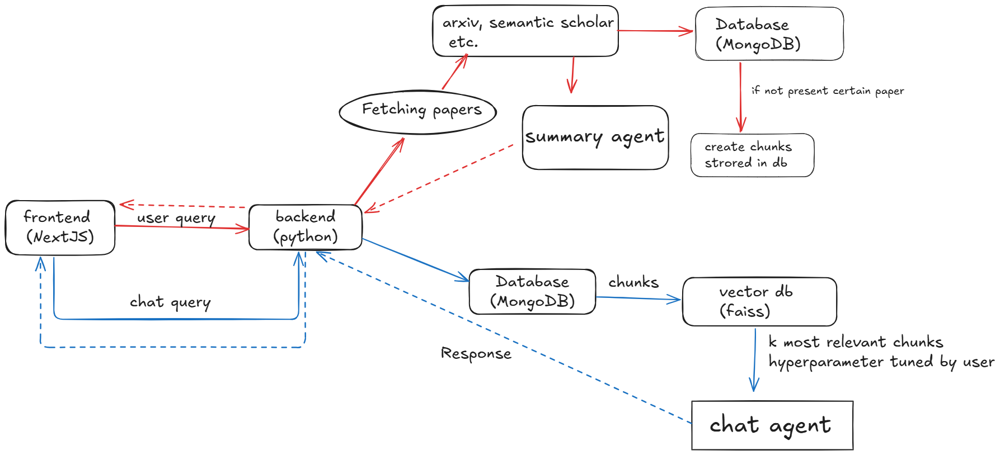

<div>
    
</div>

[](https://github.com/huggingface/huggingface_hub)
[](https://github.com/langchain-ai/langchain)
[](https://www.sbert.net/)
[](https://github.com/langchain-ai/langchain)
[](https://pymongo.readthedocs.io/)
[](https://github.com/facebookresearch/faiss)
[](https://arxiv.org/)
[](https://pymupdf.readthedocs.io/)
[](https://gunicorn.org/)
[](https://flask-cors.readthedocs.io/)


## Table of Contents
- [Pipeline](#pipeline)
- [Setting up Project](#setup)
- [Overview of frontend](#overview-of-frontend)
  - [Landing Page](#landing-page)
  - [Home Page](#home-page)
  - [Chat Environment](#chat-environment-for-each-research-paper-based-on-that-paper)
  - [Summary Generated](#summar)
- [Analytics](#analytics)
- [Link to frontend](#link-to-frontend--httpsgithubcomanishk85frosthackfrontend)
- [Demo Video](#link-to-video-explaination-and-showcase-of-our-project)

## Pipeline



## Setup

### Install requirements.txt
```bash
pip install -r requirements.txt
```

### Required .env
-   There is example.env file, rename it to .env and add values to the required env variables.

### Backend 

### How to set up the backend which exposes the API's to call agents ?
```bash
python app.py
```

This will run the server and host the backend along with agents locally and then frontend can request upon this backend.


## Overview of frontend 

### Landing Page


### Home Page


### Chat Environment for each research paper based on that paper


### Summary generated by llm using agents of that paper .


### Analytics


### Link to frontend : https://github.com/anishk85/frosthackFrontend

### Link to video explaination and showcase of our project
``` bash
https://youtu.be/XMh5Vm8Xtbc
```