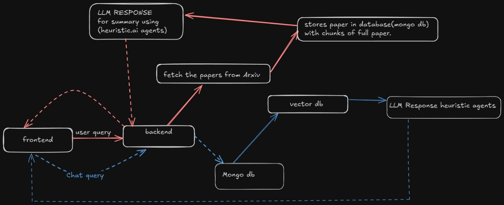
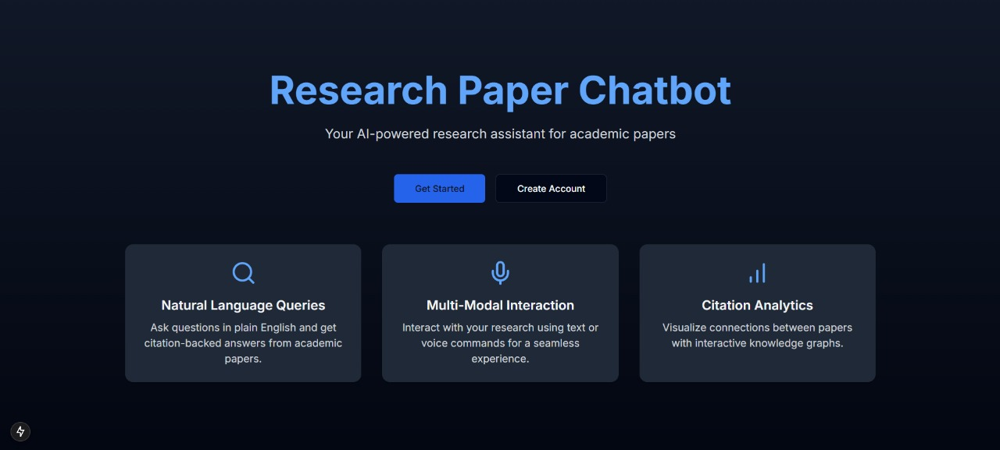
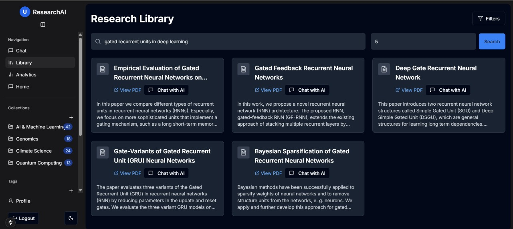
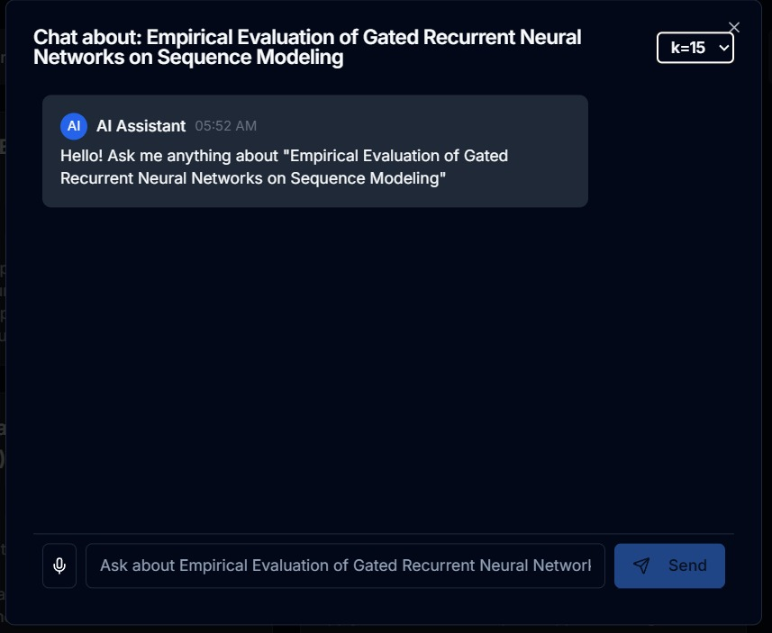
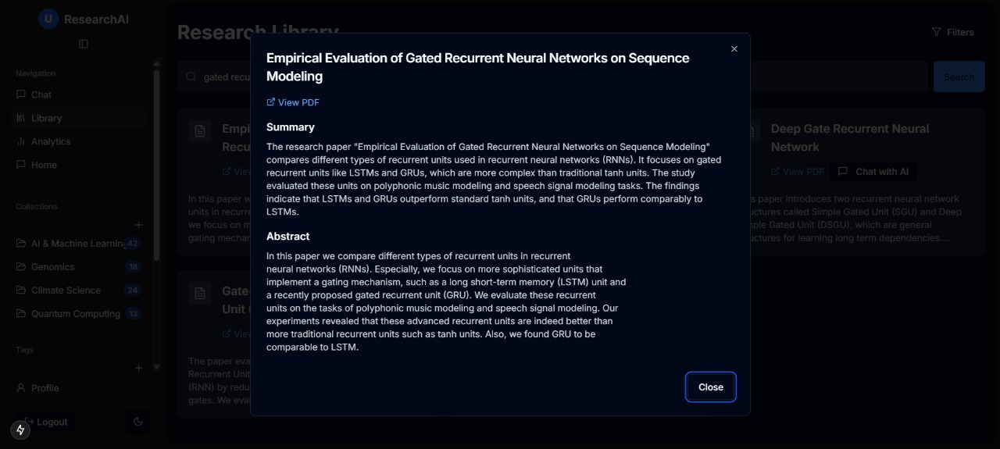
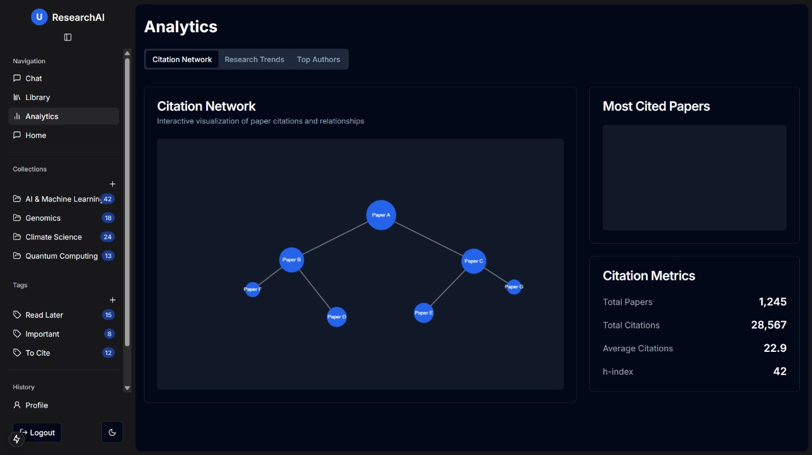

Flowchart of agent :



Research AI Agent

## Agent
-   So we are using **heurist AI agent framework** for using agents and building using it. It provides a variety of agents to work upon like Deep Reasearch Agent , telegram agent and much more etc.

## Install requirements.txt
```bash
pip install -r requirements.txt
```

### Required .env
-   There is example.env file, rename it to .env and add values to the required env variables.

## Backend 

### How to set up the backend which exposes the API's to call agents ?
```bash
python app.py
```

This will run the server and host the backend along with agents locally and then frontend can request upon this backend.


## Overview of frontend 

### Landing Page


### Home Page


### Chat Environment for each research paper based on that paper


### Summary generated by llm using agents of that paper .



### Analytics


### Link to frontend : https://github.com/anishk85/frosthackFrontend

### Link to video explaination and showcase of our project
``` bash
https://youtu.be/XMh5Vm8Xtbc
```